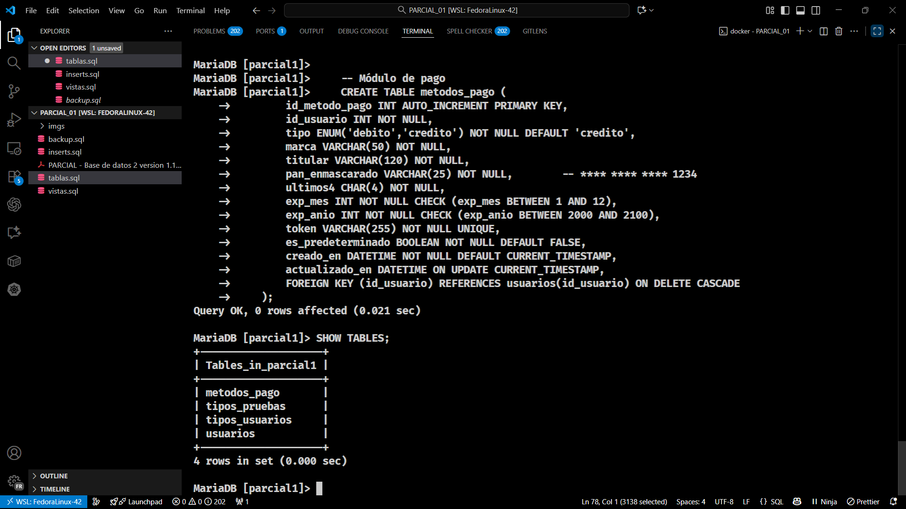
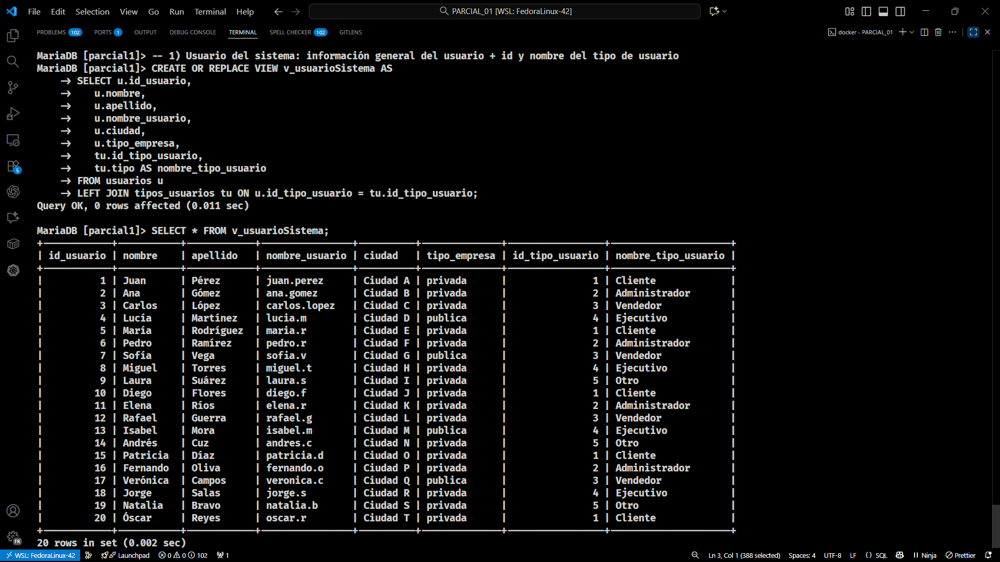
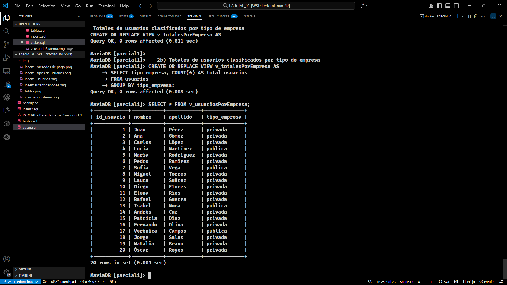
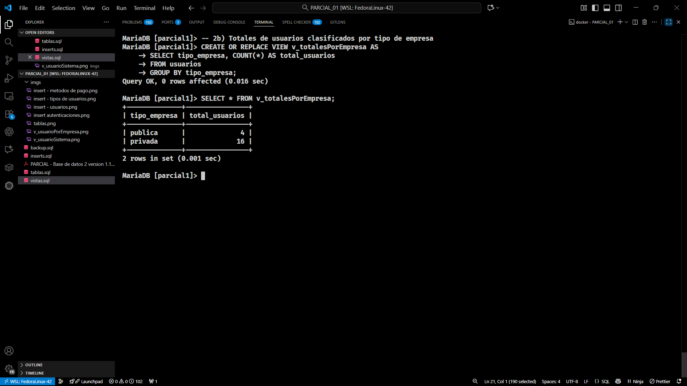
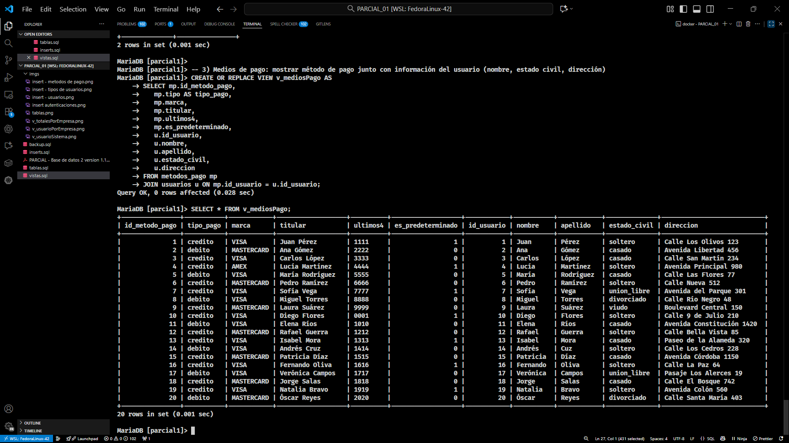
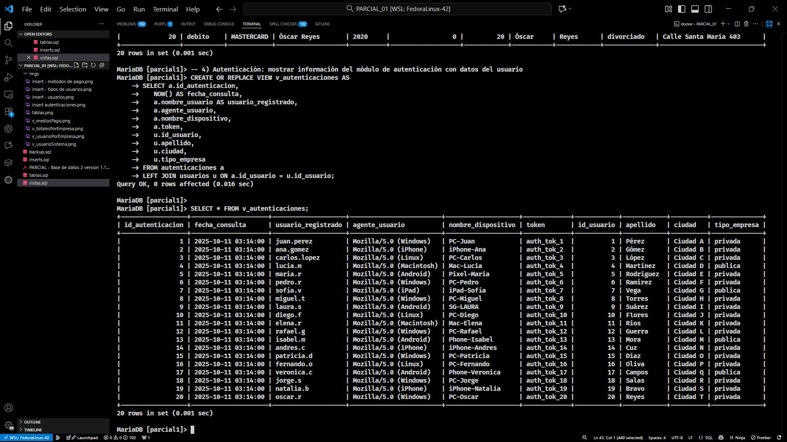

# Entrega del Parcial — Pixel-Security-360


Contenido del repositorio (estructura real del folder `PARCIAL_01`)

Archivos y carpetas en este directorio:

- `PARCIAL - Base de datos 2 version 1.1.pdf` : Enunciado / material del parcial (PDF original).
- `README.md`                                : Este archivo (instrucciones, evidencias y reflexiones).
- `backup.sql`                                : Dump o respaldo adicional incluido en el repo.
- `imgs/`                                     : Carpeta con imágenes usadas en la entrega (capturas, diagramas).
- `inserts.sql`                               : Datos de ejemplo (registros para poblar la BD).
- `tablas.sql`                                : Definición de tablas (esquema alternativo, `parcial1`).
- `vistas.sql`                                : Vista(s) y consultas solicitadas por la II PARTE.

Nota: en este folder no hay una carpeta `solution/`. Si necesitas que copie aquí los archivos de soporte adicionales (por ejemplo `solution/schema.sql`, `solution/queries.sql`, `run_mariadb.sh`) puedo moverlos o crear un subdirectorio `solution/` con esos artefactos.

Objetivo del trabajo
--------------------
El objetivo fue construir una base de datos para la plataforma Pixel-Security-360 que cumpla con los requisitos del parcial: estructuras, registros, vistas informativas y documentación de entrega (dump, capturas y reflexiones). La entrega cubre las tres partes del parcial: esquema + datos, vistas y documentación de proceso.

Evidencias que entrego (III PARTE)
---------------------------------
Según el enunciado, hay que anexar: la copia de la BD, capturas/salidas de sentencias y la documentación del proceso. Esto entrego:

1) Copia (dump) de la BD

La copia (dump) de la base de datos está en el archivo backup.sql ubicado en este mismo directorio.

2) Capturas / salidas por cada proceso

Abajo incluyo las capturas que acompañan cada paso del proceso. Cada imagen está en la carpeta `imgs/` y muestra el comando/resultado correspondiente:

- `imgs/tablas.png` — Captura de la ejecución de las sentencias DDL (creación de tablas a partir de `tablas.sql` o `solution/schema.sql`).
- `imgs/insert - tipos de usuarios.png` — Resultado de los inserts en la tabla `tipos_usuarios` (muestra los 20 registros de ejemplo).
- `imgs/insert - metodos de pago.png` — Resultado de los inserts en `metodos_pago` (métodos registrados).
- `imgs/insert - usuarios.png` — Resultado de inserts en la tabla `usuarios` (lista de usuarios de prueba).
- `imgs/insert autenticaciones.png` — Resultado de los inserts en `autenticaciones` / `auth_tokens` (registros de autenticación de usuarios).

- `imgs/v_usuarioSistema.png` — Salida de la vista `vista_usuario_sistema` (información combinada de usuario y rol/empresa).
- `imgs/v_usuarioPorEmpresa.png` — Salida de la vista `vista_usuarios_por_empresa` (usuarios agrupados por tipo de empresa).
- `imgs/v_totalesPorEmpresa.png` — Salida de la vista `vista_totales_por_empresa` (totales y sumarios por tipo de empresa).
- `imgs/v_mediosPago.png` — Salida de la vista `vista_medios_pago` (métodos de pago asociados a usuarios y últimos movimientos).
- `imgs/v_autenticaciones.png` — Salida de la vista `vista_autenticaciones` (listado de autenticaciones con `fecha_consulta`).

Ejemplo de cómo generé una salida en texto desde la línea de comandos (puedes replicarlo):

```bash
mariadb -u root -p -D pixel_security360 -e "SELECT * FROM vista_medios_pago LIMIT 10;" > evidencia_vista_medios_pago.txt
```

Imágenes incrustadas (visualización directa):

<div align="center">
	<figure>
		
		<figcaption>Creación de tablas (DDL) — archivo `tablas.sql` / `solution/schema.sql`.</figcaption>
	</figure>
	<figure>
		
		<figcaption>Insert en `tipos_usuarios` (20 registros de ejemplo, capitalizados).</figcaption>
	</figure>
	<figure>
		
		<figcaption>Insert en `metodos_pago` (metadatos JSON incluidos).</figcaption>
	</figure>
	<figure>
		
		<figcaption>Insert en `usuarios` (datos de prueba).</figcaption>
	</figure>
	<figure>
		
		<figcaption>Insert en `autenticaciones` / `auth_tokens`.</figcaption>
	</figure>
	<figure>
		
		<figcaption>Salida de la vista `vista_usuario_sistema`.</figcaption>
	</figure>
	<figure>
		
		<figcaption>Salida de la vista `vista_usuarios_por_empresa`.</figcaption>
	</figure>
	<figure>
		
		<figcaption>Salida de la vista `vista_totales_por_empresa`.</figcaption>
	</figure>
	<figure>
		
		<figcaption>Salida de la vista `vista_medios_pago`.</figcaption>
	</figure>
	<figure>
		
		<figcaption>Salida de la vista `vista_autenticaciones`.</figcaption>
	</figure>
</div>


Notas técnicas
-------------------------------------------
- Las contraseñas están como hashes de ejemplo en `contrasena_hash`. En un entorno real habría que usar hashing fuerte y sal.
¿

Lecciones aprendidas (mi reflexión personal)
--------------------------------------------
- Planificar el esquema antes de crear tablas me ahorró muchos cambios: definir claves foráneas y tipos de datos fue clave.
- Aprendí a usar vistas para separar la lógica de presentación de los datos: las vistas ayudan a construir los reportes pedidos sin duplicar datos.
- Preparar scripts como CREATE OR REPLACE o INSERT IGNORE me facilitó repetir pruebas sin limpiar todo.
