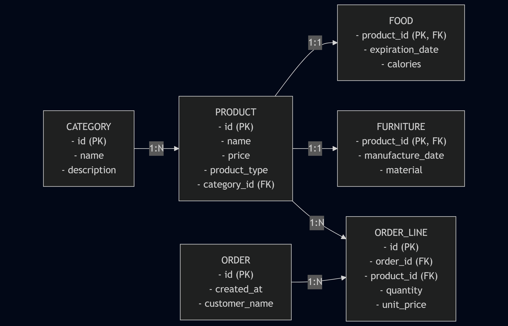
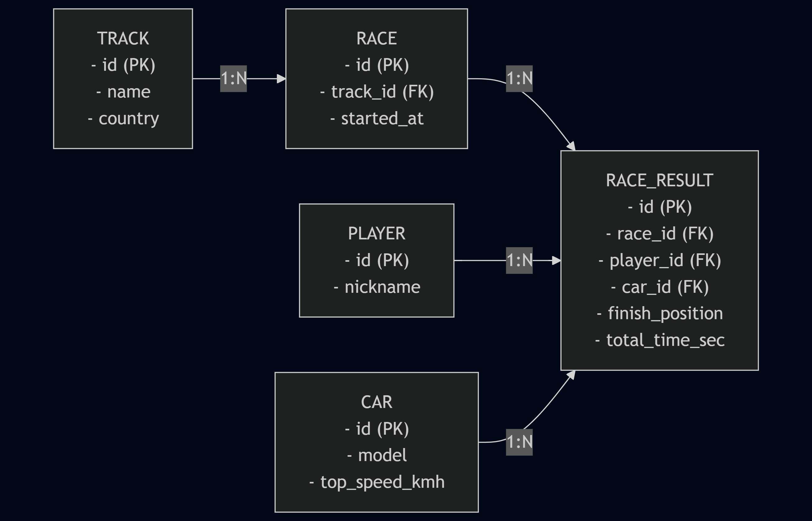

# TALLER_01 — DDL/DML + Normalización + Contenedores + Conexión

## 1) Entregables (en esta carpeta)

* `01_Comida.sql` → **Catálogo de productos** con tipo/subtipo (Product–Food/Furniture), categorías y órdenes. Incluye solo lo pedido: `CREATE TABLE`, `FOREIGN KEY`, `INSERT`, `SELECT`, `WHERE`, `JOIN`. 
* `02_Car_Racing.sql` → **Juego sencillo (Arcade Racer)** con jugadores, autos, pistas, carreras y resultados (modelo minimal con 5 tablas). También usa `CREATE TABLE`, `FOREIGN KEY`, `INSERT`, `SELECT`, `WHERE`, `JOIN`. *(El nombre del archivo es “Car_Racing”, pero el contenido corresponde al juego de carreras)*. 

## 2) Estructura de repo

```
BASE_DE_DATOS_II/
└── TALLER_01/
    ├── 01_Comida.sql
    ├── 02_Car_Racing.sql
    └── README.md  ← este archivo
```

## 3) Requisitos

* Docker instalado (para MariaDB).
* Cliente CLI (incluido en la imagen) o GUI (DBeaver / MySQL Workbench).

## 4) Pasos para probar el repo utilizando docker
### 1) Iniciar MariaDB

```bash
docker run -d --name mariadb -e MARIADB_ROOT_PASSWORD=secret -p 3306:3306 mariadb:latest
```

### 2) Cargar cada base de datos

```bash
docker exec -i mariadb mariadb -uroot -psecret < TALLER_01/01_Comida.sql
docker exec -i mariadb mariadb -uroot -psecret < TALLER_01/02_Car_Racing.sql
```

## 5) Conexión a la BD

### 5.1 CLI (Linea de Comandos)

```bash
# Entrar al cliente
docker exec -it mariadb mariadb -uroot -psecret

-- Dentro del cliente:
SHOW DATABASES;
USE catalogo_productos_simple;   -- BD del catálogo  (01_Comida.sql)  :contentReference[oaicite:2]{index=2}
SHOW TABLES;

USE arcade_racer_db_simple;      -- BD del juego     (02_Car_Racing.sql)  :contentReference[oaicite:3]{index=3}
SHOW TABLES;
```

### 5.2 Cliente gráfico (DBeaver / MySQL Workbench)

* Host: `127.0.0.1`
* Port: `3306`
* User: `root`
* Password: `secret`
* Probar conexión → Abrir editor SQL → ejecutar los scripts si no los cargaste por Docker.

## 6) Diseño, cardinalidades y normalización

### 6.1 Catálogo de productos (01_Comida.sql)

**Tablas clave:** `categories`, `products`, `foods`, `furnitures`, `orders`, `order_lines`.

* Cardinalidades:
  * `categories` (1) —— (N) `products`
  * tipo–subtipo: `products` (1) —— (1, opcional) `foods` / `furnitures` (1:1 por FK=PK)
  * `orders` (1) —— (N) `order_lines` y `products` (1) —— (N) `order_lines`


* Normalización:

  * 1FN/2FN/3FN: sin atributos multivaluados, dependencias plenas y sin transitivas; subtipos separan atributos específicos (food/furniture) y `order_lines` evita repetición de productos en `orders`. 

### 6.2 Juego sencillo (02_Car_Racing.sql)

**Tablas clave:** `players`, `cars`, `tracks`, `races`, `race_results`.

* Cardinalidades:

  * `tracks` (1) —— (N) `races`
  * `races` (1) —— (N) `race_results`
  * `players` (1) —— (N) `race_results`
  * `cars` (1) —— (N) `race_results`
* Normalización:

  * Catálogos (`players`, `cars`, `tracks`) separados; `race_results` relaciona quién corrió, con qué auto y en qué carrera, sin duplicar datos maestros. 3FN cumplida. 


## 7) Consultas de verificación rápidas

### 7.1 Catálogo de productos

```sql
-- Productos con su categoría
USE catalogo_productos_simple;
SELECT p.id, p.name, c.name AS category, p.price
FROM products p
JOIN categories c ON c.id = p.category_id
ORDER BY p.id;
```

### 7.2 Juego sencillo

```sql
-- Podio de la carrera 1
USE arcade_racer_db_simple;
SELECT rr.finish_position, p.nickname, c.model, rr.total_time_sec, t.name AS track
FROM race_results rr
JOIN races r   ON r.id = rr.race_id
JOIN tracks t  ON t.id = r.track_id
JOIN players p ON p.id = rr.player_id
JOIN cars c    ON c.id = rr.car_id
WHERE rr.race_id = 1
ORDER BY rr.finish_position;
```
