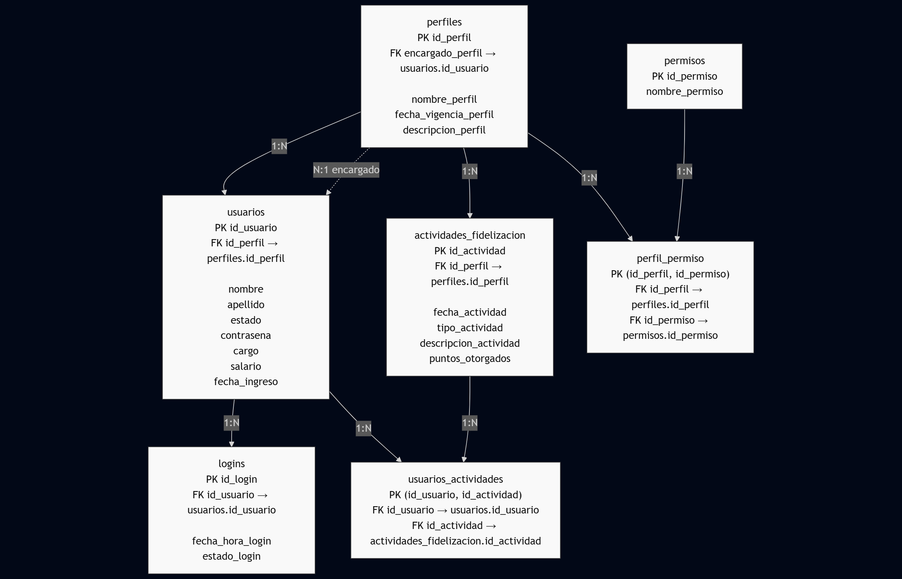

# TALLER_02 — Entregable: Base de datos empresa_taller02

Este documento centraliza los artefactos entregables y las instrucciones para ejecutar y validar la base de datos creada para el taller.

Los entregables incluidos en esta carpeta `TALLER_02/` son:

- Diagrama Entidad-Relación (ERD) en formato Mermaid (flowchart) — listo para pegar en Markdown/mermaid.
- Scripts SQL completos:
  - `01_create_tables.sql` — Creación de la base de datos y de las tablas.
  - `02_inserts.sql` — Sentencias INSERT para poblar la base con datos de simulación.
  - `03_views.sql` — Definición de vistas solicitadas.
  - `04_queries.sql` — Consultas que demuestran el uso de las vistas para escenarios de negocio.
- Documento de Lecciones Aprendidas (este mismo README).

## 1) Diagrama Entidad-Relación




### Cardinalidad del modelo

Resumen (formato: Entidad A — Entidad B : cardinalidad A→B / B→A)

- perfiles — usuarios : 1→N / N→1 (cada usuario pertenece a exactamente un perfil)
- perfiles — usuarios (rol encargado) : 1→0..1 / 1 usuario puede ser encargado de 0..N perfiles (FK opcional perfiles.encargado_perfil)
- usuarios — logins : 1→N / cada login pertenece a exactamente 1 usuario
- usuarios — actividades_fidelizacion : N→N mediante usuarios_actividades (tabla puente con PK compuesta)
- perfiles — perfil_permiso : 1→N (cada fila de perfil_permiso asocia un permiso lógico a un perfil; si se añade una tabla permisos, sería N↔N por otra tabla puente)

Diagrama cardinalidades (Mermaid ER simplificado)

Nota sobre encargado_perfil:
- La FK encargardo_perfil (en perfiles) es opcional (0..1). Representa un usuario que actúa como responsable del perfil sin afectar la pertenencia base usuario→perfil.
- Un mismo usuario puede ser responsable de varios perfiles (relación 1 usuario → N perfiles en ese rol).


## 2) Scripts SQL incluidos (ubicación y propósito)

Ruta: `TALLER_02/` (esta misma carpeta)

- `01_create_tables.sql` — Crea la base `empresa_taller02` y las tablas:
  - `perfiles`, `usuarios`, `logins`, `actividades_fidelizacion`, `usuarios_actividades`, `perfil_permiso`.
  - Contiene las FKs y la nota sobre la FK circular (perfiles.encargado_perfil -> usuarios.id_usuario) preservada del script original.

- `02_inserts.sql` — INSERTs para poblar perfiles, usuarios, logins, actividades y la tabla intermedia `usuarios_actividades` (implementa la relación N:N entre usuarios y actividades).

- `03_views.sql` — Definición de vistas de reporte (p.ej. `v_DesempenoColaboradores`, `v_actividadesPorPerfil`, `v_historialLoginDetallado`).

- `04_queries.sql` — Consultas que usan las vistas para responder escenarios de negocio: recuentos, puntos por usuario, tiempos entre logins, top colaboradores, etc.

## 3) Cómo ejecutar los scripts (solo MariaDB en Docker)

Los scripts están numerados (01_, 02_, 03_, 04_) y se ejecutan en orden numerico. Usaremos la inicialización automática de MariaDB para los tres primeros (DDL, INSERTs y VISTAS). El archivo 04 (consultas) conviene ejecutarlo manualmente.

Requisitos:
- Docker instalado
- Ruta local del proyecto: /home/frjr17/base-de-datos-ii/TALLER_02

Pasos:

1. (Opcional) Exporta la ruta del proyecto  
```bash
export PROJECT_DIR=/home/frjr17/base-de-datos-ii
```

2. Inicia el contenedor montando la carpeta del taller para ejecución automática de 01_ a 03_  
```bash
docker run -d \
    --name mariadb-taller02 \
    -e MARIADB_ROOT_PASSWORD=secret \
    -v $PROJECT_DIR/TALLER_02:/docker-entrypoint-initdb.d/init \
    mariadb:10.11
```
Notas:
- Si no exportaste la ruta del proyecto, deberás ingresarla manualmente en el comando de docker en lugar de la variable de entorno.
- 04_queries.sql también se ejecutaría si lo dejas ahí; si no quieres eso, renómbralo o ejecútalo manualmente (recomendado).

3. Verifica que la inicialización terminó  
```bash
docker logs -f mariadb-taller02
```

4. Entra al contenedor y abre cliente MariaDB  
```bash
docker exec -it mariadb-taller02 mariadb -uroot -p
# (password: secret)
```

5. Usa la base y ejecuta las consultas del archivo 04 (sin haberlo autocargado)  
Dentro del cliente:
```sql
USE empresa_taller02;
SOURCE /docker-entrypoint-initdb.d/init/04_queries.sql;
```

Alternativa (ejecutar 04 desde el host sin abrir el cliente):
```bash
docker exec -i mariadb-taller02 mariadb -uroot -psecret empresa_taller02 < $PROJECT_DIR/TALLER_02/04_queries.sql
```

Limpieza (si necesitas reconstruir todo):
```bash
docker rm -f mariadb-taller02
docker volume prune -f  
# Repetir pasos 2+
```

## 4) Escenarios de negocio cubiertos (ejemplos en `04_queries.sql`)
### ¿Cuáles son los 5 colaboradores con mejor desempeño en fidelización en  el último trimestre y cuál es su cargo? 
Para obtener este resultado, utilizamos la vista v_DesempenoColaboradores con el atributo **LIMIT 5** para limitar las salidas a los mejores 5 usuarios
```sql
SELECT * FROM v_DesempenoColaboradores LIMIT 5;
```

### ¿Qué perfiles tienen la menor participación en actividades de fidelización y requieren un plan de incentivos? 
Para obtener este resultado, utilizamos la vista v_DesempenoColaboradores con el atributo **ORDER BY puntos_totales ASC** para cambiar la dirección de ordenamiento a ascendente (de menores puntos a mayores puntos) y el atributo con el atributo **LIMIT 3** para limitar las salidas a los 3 empleados con menores puntos.
 ```sql
 SELECT * FROM v_DesempenoColaboradores ORDER BY puntos_totales ASC LIMIT 3;
 ```
### ¿Qué usuarios no han iniciado sesión en los últimos 30 días y cuál fue su último cargo? 
Para obtener esta información, utilizamos la vista v_historialLoginDetallado con el atributo **WHERE tiempo_desde_anterior_login >= 43200** para saber los usuarios que no han iniciado sesión en los últimos 30 días. (43200 son los minutos que corresponden a las 30 días).

```sql
SELECT * FROM v_historialLoginDetallado WHERE tiempo_desde_anterior_login >= 43200;
```

### Obtener un reporte mensual de la cantidad de logins exitosos vs. fallidos. 
Para obtener esta información, es necesario utilizar la tabla v_historialLoginDetallado utilizanndo **COUNT(estado_login)** para obtener el numero de logins fallidos y exitosos (este hecho en una subconsulta) y añadir el atributo **WHERE  estado_login = 'fallido' AND fecha_hora_login >= DATE_SUB(NOW(),INTERVAL 1 MONTH)** para limitar la busqueda a 1 mes a partir de la fecha actual.

```sql
SELECT (SELECT COUNT(estado_login) from v_historialLoginDetallado WHERE estado_login = 'exitoso') AS login_exitoso, COUNT(estado_login) FROM v_historialLoginDetallado WHERE  estado_login = 'fallido' AND fecha_hora_login >= DATE_SUB(NOW(),INTERVAL 1 MONTH);
```

## 5) Lecciones Aprendidas

1. Relación N:N (usuarios ↔ actividades):
	- Desafío: el diseño inicial modelaba una relación 1:N con FK directa. Para cubrir el requisito de que una actividad pueda tener varios participantes y un usuario participe en varias actividades se migró a una tabla intermedia `usuarios_actividades`.
	- Solución: creación de `usuarios_actividades` con PK compuesta `(id_usuario, id_actividad)` y eliminación de la FK directa en `actividades_fidelizacion`.
	- Aprendizaje: en scripts de sql usar IDs explícitos es aceptable.

2. Consistencia de nombres y pluralización:
	- Desafío: cambiar la convención de nombres a plural para tablas y mantener coherencia en todos los scripts.
	- Aprendizaje: usar convenciones desde el inicio evita cambios en cascada; cuando se hacen, hay que actualizar cuidadosamente todas las referencias y probar las vistas.

3. Vistas y cálculo de tiempo entre filas:
	- Desafío: calcular "tiempo desde el login previo" por usuario en una vista sin funciones de ventana es complejo y propenso a errores.
	- Solución: La solución de hacer subconsultas es provechosa, aunque puede llegar a ser dificil de interpretar con el tiempo.
